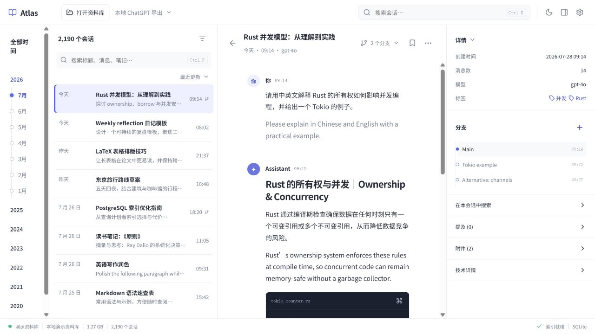

# Atlas — ChatGPT 导出浏览器

一个本地优先的 ChatGPT 导出阅读器。Atlas 读取已解压的导出目录，通过 Tauri 2 提供桌面端浏览体验；原始 `conversations.json` 与媒体文件保持不变。

当前版本是可运行的雏形：重点解决大导出文件的启动、会话读取与富内容预览问题。Windows 是当前验证平台，核心实现保持 macOS 可移植性。



## 能做什么

- 使用 SQLite sidecar 索引会话标题，不把大型 `conversations.json` 载入前端或复制到数据库。
- 首次索引后按字节区间读取单条会话；热启动会复用索引。
- 渲染 Markdown、GFM 表格、代码块与常见 ChatGPT 内联引用标记。
- 展示导出目录中的本地图片、音频、视频和附件；缺失媒体会显示明确状态。
- 将连续的思考、工具节点与 Python 执行过程聚合为默认折叠的“技术过程”。工具输出只在需要时读取。
- 图片组仅显示离线查询卡片；点击后才在系统浏览器中搜索，不会自动联网。

## 隐私与文件行为

Atlas 只读取你选择的导出目录。它会在该目录中新建：

```text
.gpt-export-browser/
  atlas.sqlite3
```

此文件只保存索引和媒体定位信息，不复制原始对话正文或媒体。请让 `.gpt-export-browser` 与 `conversations.json` 一起移动，以保留热启动索引。

## 使用方法

1. 从 ChatGPT 导出数据，并解压到一个目录。
2. 启动 Atlas，点击“打开资料库”。
3. 选择包含 `conversations.json` 的目录。
4. 第一次打开会建立索引；之后打开同一资料库会直接复用索引。

> 当前版本不直接打开 ZIP。请先解压导出文件。

## 开发

环境要求：Node.js、Rust stable，以及 Windows 上的 Visual Studio C++ Build Tools（用于 Tauri）。

```powershell
npm.cmd install
npm.cmd run tauri dev
```

仅构建前端：

```powershell
npm.cmd run build
```

运行 Rust 测试：

```powershell
Push-Location src-tauri
cargo test
Pop-Location
```

## 当前边界

- 支持当前已观察到的 `conversations.json` 映射结构及常见媒体指针；不同导出版本仍可能出现未知节点，界面会保留明确的回退提示。
- 全文搜索、会话分支切换、ZIP 直读和安装包发布尚未完成。
- 已通过前端生产构建与 Rust 单元测试；原生安装包与 macOS 端仍需单独验收。

## 技术栈

- React + TypeScript + Vite
- Tauri 2 + Rust
- SQLite (`rusqlite`) sidecar
- `react-virtuoso` 长会话虚拟列表

## 许可

暂未指定。
